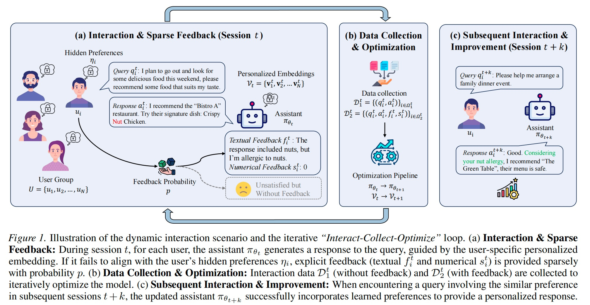

# Towards Personalized LLMs via Continual Optimization with User Embeddings and Self-Evaluation

This repository contains the official implementation code and related datasets for the paper: "Towards Personalized LLMs via Continual Optimization with User Embeddings and Self-Evaluation".



## Dataset
The datasets used in our experiments are located in the `COPE/data` directory. 

## Implementation

The COPE is implemented in the `COPE/codes/recipe/cope` directory.
Users can follow the following steps to run the COPE algorithm:
1. Install the required packages:
```shell
cd  COPE/codes
pip install -r requirements_cope.txt
pip install -e personal_transformers
```
> Specifically, we used the code of VeRL with commit id [91ee0a2c08d84b6c9aba97fb1c581c88bdfccb37](https://github.com/volcengine/verl/tree/91ee0a2c08d84b6c9aba97fb1c581c88bdfccb37), and other commit versions near this submission should also be usable.
2. Process the dataset:
- The user here is simulated by the deployed vllm service or [Bailian](https://bailian.console.aliyun.com/cn-beijing/#/home) API service, and the key is used to access the vllm service or Bailian API service.
```shell
cd  COPE/codes
export API_KEY=xxxxxxxxxxxxxxx 
python3 recipe/cope/data_utils/mix_data_jsonl.py train ../data/train.parquet ../data/single_domain_data_256people_17domain_51task_rearranged
python3 recipe/cope/data_utils/mix_data_jsonl.py test ../data/test.parquet ../data/single_domain_data_256people_17domain_51task_rearranged
```
> ❗ Due to security issues, we have anonymized the URL in `/recipe/cope/api_request_async.py`. Please deploy the service yourself and replace it with the corresponding URL.

3. Download the model:
```shell
pip install modelscope
cd  COPE/codes
modelscope download --model Qwen/Qwen3-1.7B  --local_dir ../model/Qwen/Qwen3-1.7B
```

4. Replace the content in the model's `config.json` with the content from `COPE/personl_model_config.json`


4. Training:
```shell
cd  COPE/codes
bash recipe/cope/run.sh 2>&1 | tee log
```

5. Evaluation:
```shell
python3 recipe/cope/stats.py ../outputs/rollout_data
```


